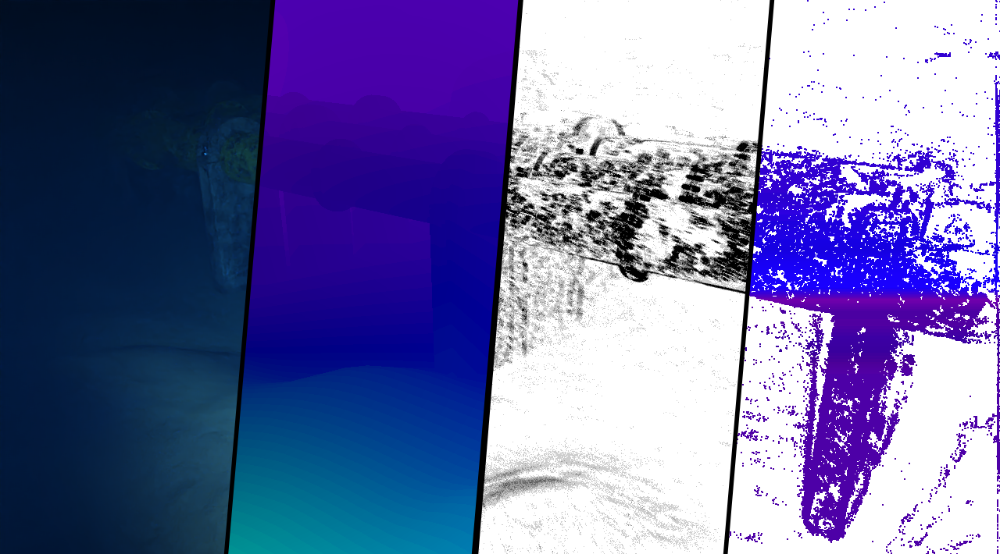
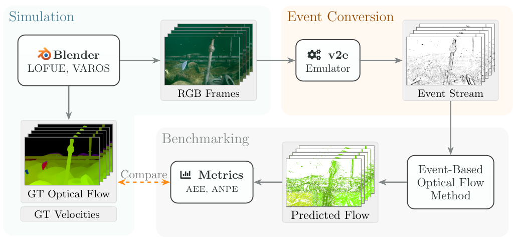

# UEOF: A Benchmark Dataset for Underwater Event-Based Optical Flow

[](https://robotic-vision-lab.github.io/ueof/)
[](https://arxiv.org/pdf/2601.10054)
[](https://doi.org/10.32855/dataset.2026.02.045)

## Overview

Underwater imaging is fundamentally challenging due to wavelength-dependent
light attenuation, strong scattering from suspended particles,
turbidity-induced blur, and nonuniform illumination. These effects impair
standard cameras and make ground-truth motion nearly impossible to obtain. To
address this problem, we introduce the first synthetic underwater benchmark
dataset for event-based optical flow derived from physically-based ray-traced
RGBD sequences.

<p align="center">
  
</p>

This repository provides source code for our 2026 WACV Workshop paper titled
"[UEOF: A Benchmark Dataset for Underwater Event-Based Optical
Flow](https://openaccess.thecvf.com/content/WACV2026W/EVGEN-2026/papers/Truong_UEOF_A_Benchmark_Dataset_for_Underwater_Event-Based_Optical_Flow_WACVW_2026_paper.pdf)."
Using a modern video-to-event pipeline applied to rendered underwater videos,
we produce realistic event data streams with dense ground-truth flow, depth,
and camera motion. Moreover, we benchmark state-of-the-art learning-based and
model-based optical flow prediction methods to understand how underwater light
transport affects event formation and motion estimation accuracy. Our dataset
establishes a new baseline for future development and evaluation of underwater
event-based perception algorithms.

More information on the project can be found on the [UEOF
website](https://robotic-vision-lab.github.io/ueof).

The dataset is available from [MavMatrix](https://doi.org/10.32855/dataset.2026.02.045). This repository contains:

- Dataset format documentation
- Scripts used to generate dataset artifacts
- Modified loaders and configs for benchmark methods
- Evaluation scripts for optical flow predictions

## Dataset Layout

The published dataset package is organized by environment and scene:

```text
dataset_root/
├── deep/
│   ├── scene1/
│   ├── scene2/
│   ├── ...
│   └── scene5/
└── shallow/
    ├── scene1/
    ├── scene2/
    ├── ...
    └── scene5/
```

Some benchmark configs in this repository use `s1` to `s5` for the deep split. If your downloaded dataset uses `scene1` to `scene5`, update the paths or create symlinks before running those configs.

## Scene Directory Contents

Each scene directory contains the following files and subdirectories:

| File / Folder | Format | Description |
| :-- | :-- | :-- |
| `events.h5` | HDF5 | Raw event data |
| `gt_flow/` | `.flo` | Ground truth optical flow in Middlebury format |
| `images/` | `.png` | RGB image frames |
| `depth/` | `.png` | Depth maps, deep environment only |
| `gt_flow_timestamps.txt` | `.txt` | Timestamps for flow files in milliseconds |
| `image_timestamps.txt` | `.txt` | Timestamps for RGB frames in milliseconds |
| `evaluation_timestamps.txt` | `.txt` | Start and end time pairs for evaluation windows in milliseconds |
| `velocities.npz` | `.npz` | Linear and angular ego-velocity, omitted for static scenes |

The `depth/` directory is present only in deep environment scenes. `velocities.npz` is omitted for static scenes, currently `shallow/scene1` and `shallow/scene5`.

All image and flow files use zero-padded five-digit names starting from `00000`, such as `00000.png` and `00001.flo`.

## Data Specifications

### Event Data

Events are stored in `events.h5` under an HDF5 dataset named `events` with shape `(N, 4)`. Each row follows `(t, x, y, p)`:

- `t`: timestamp in microseconds, `uint32`
- `x`, `y`: pixel coordinates, `uint32`
- `p`: event polarity, `uint32`, where `0` is negative and `1` is positive

Event resolution:

- deep environment: `1280x720`
- shallow environment: `960x540`

Event data is generated via v2e. 

### Ground Truth and Image Timing

Ground-truth optical flow and image frames use the following temporal resolutions:

- shallow-water environment: 30 Hz
- deep-water environment: 10 Hz

All timestamp files use milliseconds. Deep environment timestamps are integers, while shallow environment timestamps are floating point.

- `image_timestamps.txt`: one timestamp per line corresponding to files in `images/`
- `gt_flow_timestamps.txt`: one timestamp per line corresponding to files in `gt_flow/`

Optical flow is computed between consecutive frames. For `N` images, there are typically `N - 1` flow files, where flow file `i` represents the flow from image `i` to image `i + 1`. 

### Evaluation Windows

`evaluation_timestamps.txt` defines the time windows used for optical flow evaluation:

```text
Format: start_time end_time

Example, deep 10 Hz integer milliseconds:
0 100
100 200
200 300

Example, shallow 30 Hz floating-point milliseconds:
0.0000000 33.3333333
33.3333333 66.6666667
66.6666667 100.0000000
```

### Velocity Data

Velocity is saved as uncompressed NumPy `.npz` archives in `velocities.npz`. This file contains linear and angular velocities and is omitted for static scenes.

Deep environment scenes contain:

| Array Key | Shape | Dtype | Description |
| :-- | :-- | :-- | :-- |
| `timestamps` | `(N,)` | `int64` | Timestamps in microseconds |
| `pos` | `(N, 3)` | `float64` | Position in the world frame, in meters |
| `quat` | `(N, 4)` | `float64` | Unit quaternion orientation in `xyzw` format |
| `lin_vel` | `(N, 3)` | `float64` | Linear velocity in the camera frame, in m/s |
| `ang_vel` | `(N, 3)` | `float64` | Angular velocity in the camera frame, in rad/s |

Shallow environment scenes contain:

| Array Key | Shape | Dtype | Description |
| :-- | :-- | :-- | :-- |
| `timestamps` | `(N,)` | `int64` | Timestamps in microseconds |
| `lin_vel` | `(N, 3)` | `float64` | Linear velocity in the camera frame, in m/s |
| `ang_vel` | `(N, 3)` | `float64` | Angular velocity in the camera frame, in rad/s |

Shallow scenes do not include `pos` and `quat` arrays.

### Depth Data

Depth maps are provided for all deep environment scenes in `depth/`. Each file is a 16bit grayscale PNG named to match its corresponding RGB frame, such as `00000.png`.

Encoding follows the [KITTI depth standard](http://www.cvlibs.net/datasets/kitti/): each pixel stores the distance from the camera to the corresponding surface element, linearly mapped to the 16-bit unsigned integer range `[0, 2^{16} - 1]`.

The depth resolution `r` is given by:

$$r = \frac{d_{\text{end}} - d_{\text{start}}}{2^{16} - 1}$$

With maximum range `d_end = 25 m` and `d_start = 0 m`, this yields a resolution of about `0.381 mm/count`.

To recover depth in meters from a raw pixel value `v`:

$$d = v \times \frac{25}{65535}$$

Pixel value `65535` indicates invalid or occluded depth. Mask this value before converting pixel values to meters to avoid false maximum-range readings.

## Dataset Statistics

| Environment | Scene | Duration | Images | Flows | Events | Velocity | Depth |
| :-- | :-- | :-- | --: | --: | :-- | :-- | :-- |
| deep | scene1 | 45s | 451 | 450 | 196M | yes | yes |
| deep | scene2 | 92s | 923 | 922 | 400M+ | yes | yes |
| deep | scene3 | 137s | 1372 | 1371 | 590M+ | yes | yes |
| deep | scene4 | 26s | 265 | 264 | 100M+ | yes | yes |
| deep | scene5 | 170s | 1703 | 1702 | 720M+ | yes | yes |
| shallow | scene1 | 50s | 1501 | 1501 | 106M | no | no |
| shallow | scene2 | 62s | 1501 | 1501 | 289M | yes | no |
| shallow | scene3 | 67s | 2001 | 2000 | 390M+ | yes | no |
| shallow | scene4 | 67s | 2001 | 2001 | 400M+ | yes | no |
| shallow | scene5 | 67s | 2001 | 2001 | 380M+ | no | no |

Static scenes, `shallow/scene1` and `shallow/scene5`, have no ego-motion and therefore no velocity data. Shallow sequences contain an extra empty ending flow file.

## Benchmarking Code

The `benchmarking/` directory contains repository-specific code for the methods evaluated in the paper. The benchmark implementations are organized so they can be copied into their corresponding upstream projects with minimal changes.

- `benchmarking/event_based_optical_flow/`
  - configs for the patch CMax benchmark
  - one config per scene or sequence

- `benchmarking/EINCM/`
  - modified dataloader for UEOF sequences
  - runnable experiment scripts under `benchmarking/EINCM/scripts/`

- `benchmarking/E-RAFT/`
  - loader adapted for UEOF-style data access

- `benchmarking/MotionPriorCMax/`
  - inference loader and config for DSEC-style evaluation

- `benchmarking_scripts/DSEC-format_benchmark.py`
  - evaluates predicted DSEC-format PNG flow against `.flo` ground truth
  - reports AEPE, REE, AAE, and N-pixel error metrics

## Running the Benchmarks

The benchmark configs are written with local path placeholders. Before running them, update the dataset root and output directories to match your machine.

The configs and scripts use the following sequence naming convention:

- shallow split: `scene1` to `scene5`
- deep split: `s1` to `s5`

### Patch Contrast Maximization

The configs under `benchmarking/event_based_optical_flow/config/` define one sequence per YAML file.

Example entries:

- shallow: `shallow-1.yaml` through `shallow-5.yaml`
- deep: `deep-s1.yaml` through `deep-s5.yaml`

Each config points to:

- `data.root`: the dataset root
- `data.sequence`: the sequence name
- `data.gt`: the ground-truth flow directory
- `output.output_dir`: where predictions are written

### EINCM

The runnable scripts are in:

- `benchmarking/EINCM/scripts/shallow/`
- `benchmarking/EINCM/scripts/deep/`

Each script launches `experiments.e16` with the appropriate sequence name, event count, and optimization settings.

### MotionPriorCMax

The default inference config is:

- `benchmarking/MotionPriorCMax/config/exe/dsec_inference/config.yaml`

Edit the dataset root, checkpoint path, and output directory before running inference.

### DSEC Style Evaluation

Use `benchmarking_scripts/DSEC-format_benchmark.py` to score predicted flow PNGs against `.flo` ground truth:

```bash
python benchmarking_scripts/DSEC-format_benchmark.py \
  --pred_dir path/to/pred_pngs \
  --gt_dir path/to/gt_flo \
  --output_csv results.csv
```

Optional arguments:

- `--thresholds 1 2 3 5 10 20`
- `--tau 0.5`
- `--output_csv results.csv`

## Dataset Generation Pipeline

The dataset generation utilities under `dataset_scripts/` are split into two stages:

1. `dataset_scripts/v2e/`
   - shell scripts for generating event streams from rendered videos with `v2e`
   - separate configs for the shallow and deep dataset splits

2. `dataset_scripts/ground_truth_generation/`
   - `blender_velocity_generation.py` exports camera linear and angular velocities from Blender
   - `deep_velocity_generation.py` splits the deep sequence velocities into `s1` to `s5`
   - `deep_gt_flow_generation.py` computes dense ground-truth optical flow and validity masks from RGB, depth, poses, and camera intrinsics

The scripts assume the data is already organized on disk. The repository does not prescribe a single raw data layout, but the benchmark configs use example roots such as `/datasets/shallow` and `/datasets/deep`.

## Repository Structure

```text
.
├── benchmarking/                     # method specific benchmark code and configs
├── benchmarking_scripts/             # shared evaluation utilities
├── dataset_scripts/                  # dataset generation helpers
├── assets/
└── README.md
```

## Citation

If you find this project useful, please cite both the paper and the dataset.

```bibtex
@inproceedings{truong2026ueof,
  title={{UEOF}: A benchmark dataset for underwater event-based optical flow},
  author={Truong, Nick and Karmokar, Pritam P and Beksi, William J},
  booktitle={Proceedings of the IEEE/CVF Winter Conference on Applications of Computer Vision (WACV) Workshops},
  pages={645--655},
  year={2026}
}

@data{mavmatrix/dataset.2026.02.045,
  title={{UEOF}},
  author={Truong, Nick and Karmokar, Pritam P and Beksi, William J},
  publisher={MavMatrix},
  version={V1},
  url={https://doi.org/10.32855/dataset.2026.02.045},
  doi={10.32855/dataset.2026.02.045},
  year={2026}
}
```

## UEOF Pipeline

<p align="center">
  
</p>

## License

The source code associated with this project is licensed under the [Apache License, Version 2.0](https://www.apache.org/licenses/LICENSE-2.0).

The **UEOF** dataset is available for non-commercial use under the [Creative Commons Attribution-NonCommercial-ShareAlike 4.0 International Public License ("CC BY-NC-SA 4.0")](https://creativecommons.org/licenses/by-nc-sa/4.0/legalcode).

## Acknowledgments

This material is based upon work supported by the Office of Naval Research under award number N000142512349.
